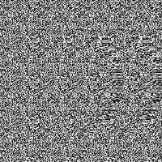
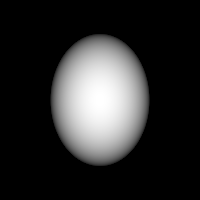

# Making a random-dot stereogram

Surprisingly easy! Here's an ellipsoid:

Generated from this depthmap:

To write this relatively simple bit of code I referred to [wikipedia's description](https://en.wikipedia.org/wiki/Autostereogram#Random-dot) and [flothesof's python code](https://flothesof.github.io/making-stereograms-Python.html).
