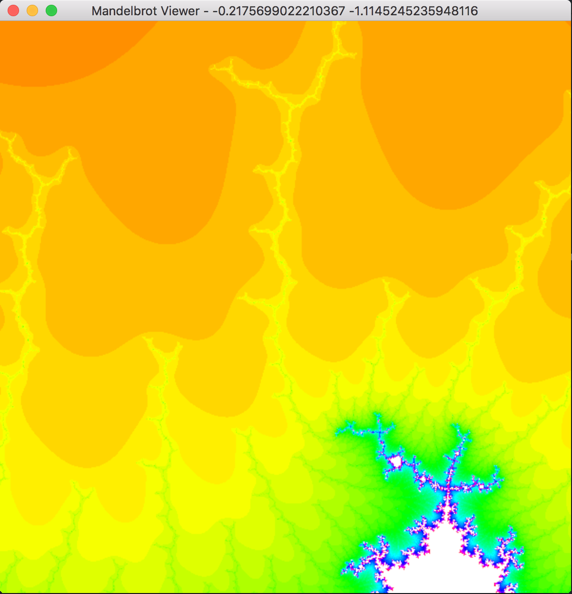

## Mandelbrot viewer in Rust

```
cargo run
```

Left click to zoom in to the image. Right click to go undo zoom. Compiled release is much faster.



Loosely inspired by a [Princeton assignment](http://www.cs.princeton.edu/courses/archive/spr01/cs126/assignments/mandel.html).
