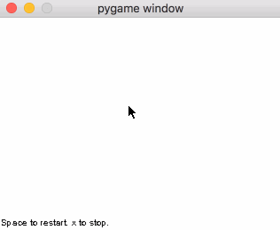

These projects are from the honors programming class I was intimidated by as an undergrad and never took. The projects are thoughtful and interesting, and I've decided to go back and code up versions of them.

- prog3 - A grid world where creatures are driven by interpreted code. The original assignment is an interpreter. I've built the grid world and behaviors as well in this Python port. Referenced https://github.com/rvnair/prog3.git in some places.

