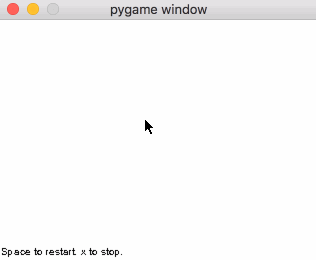

# prog3

This project is based on an assignment from CS315H, one of the honors programming classes at UT. It is a grid world where creatures behave according to interpreted code. The original assignment is an interpreter. I've also built the grid world and behaviors as well in this Python port. Referenced https://github.com/rvnair/prog3.git in some places.



## Install

```bash
# might require `brew switch python 3.6.4_4`
python3 -m virtualenv env
. ./env/bin/activate
python -m pip install -r requirements.txt
```

## Quickstart

```bash
. ./env/bin/activate
venvdotapp
python critter.py
```

There are examples of headless execution in `headless.py`.

## Tests

```bash
. ./env/bin/activate
pytest test.py
```

## Extracting Java method signatures
```bash
javap -cp Critter.jar -verbose assignment.Critter
```

## Future directions
- Compiler?
- Evolution of critters using headless evaluation of fitness?
