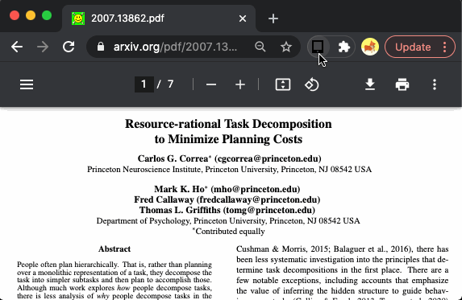

# Chrome Extension to sync to Sony DPT-RP1

This Chrome extension can be used to sync an opened PDF to your Sony DPT-RP1.

To setup, load the unpacked extension. Then drag and drop the device ID and private key (per instructions in app). Then you're off to the races! Send any PDF you desire to your DPT-RP1.

This app makes several assumptions: 1) that you've registered your device with the Digital Paper App. 2) that you are on the same wifi network as the device. 3) that your device is accessible via https://digitalpaper.local:8443.

Credits
- Icon is courtesy of Open Iconic, originally the tablet-8x.png file — www.useiconic.com/open
- Borrowed a lot of code and early inspiration (particularly PKSC conversion) from https://github.com/JoeKays/dpts, a TypeScript API.
- Used this Python script as a reference https://github.com/janten/dpt-rp1-py
