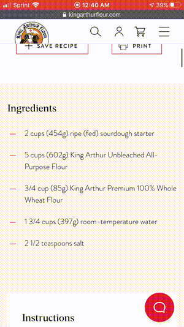

# Recipe Calculator bookmarklet

The Recipe Calculator makes it easy to tweak the quantities and units in a recipe! You'll install it as a bookmark. To use, visit a recipe and click the bookmark to adjust your recipe based on what you've got at hand.

## Installation

On a desktop computer, drag the bookmarklet link above to your bookmarks toolbar. To use it, go to a recipe and click on the bookmark.

[Recipe Calculator Link]({{site.data.recipe.BOOKMARKLET}})

On iOS,
1. Bookmark this page (tap share icon, then bookmark icon).
2. <a href="#" onclick="copy();return false;">Click here</a> to copy the bookmark or select and copy it below.
<code style="display: block;overflow: hidden;white-space: nowrap;">{{site.data.recipe.BOOKMARKLET}}</code>
3. Go to bookmarks and tap "edit". Paste in the address you copied in the previous step.
4. Try it out: Go to a recipe and click on the bookmark!

## Supported sites:

- [New York Times Cooking](https://cooking.nytimes.com/)
- [King Arthur Flour](https://www.kingarthurflour.com/recipes)
- [bon appétit](https://www.bonappetit.com/)
- All websites with [schema.org](https://schema.org/)-compliant usage of `recipeIngredient`. Includes [Smitten Kitchen](https://smittenkitchen.com/), allrecipes, and [epicurious](https://www.epicurious.com/).
