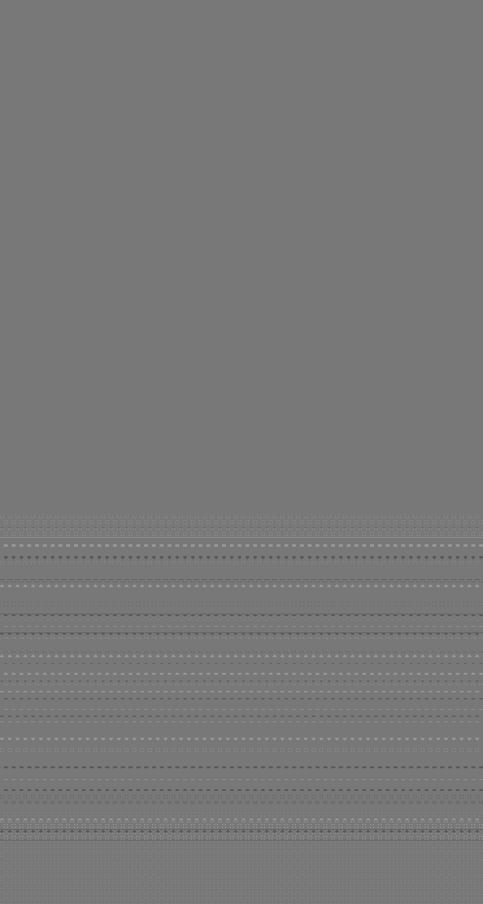

## Generating my favorite iOS wallpaper

This random project was a slightly hair-brained desire to programmatically generate one of my favorite
wallpapers form iOS 7. I sometimes lose track of the background and have to dig around to find it
and one time wondered how hard it would be to programmatically generate it.

This program models the vertical change in pixel intensity in the foreground and background of the image
using degree-3 polynomials and draws the circles in the image using alpha compositing so that circle
edges are a blend of the foreground and background at each vertical location. The program still isn't
completely perfect, but all remaining pixel differences are magnitude +1 or -1 which I mostly attribute
to numerical errors or the approximation that comes from modeling the vertical change in pixel intensity.

# Original

# Generated

# Difference

