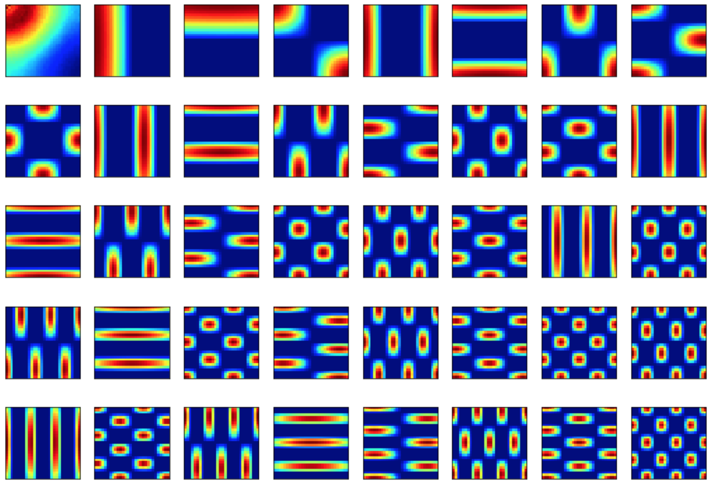
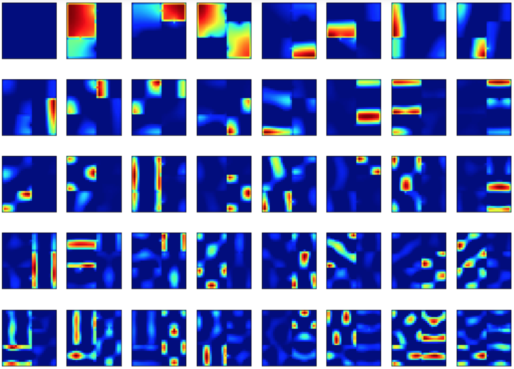

Some code implementing simple simulations from Stachenfeld et al. "The hippocampus as a predictive map".

Here are eigenvectors of the SR for a rectangular grid:

Here are eigenvectors of the SR for the Multi-Compartment II map in the supplementary materials:

