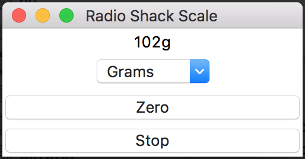
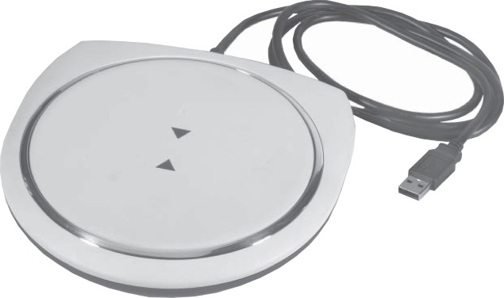

# Radio Shack USB Scale 26-950

A program to use a Radio Shack USB Scale I've had for some years. The scale has no screen and comes with Windows drivers, so this program makes it work for Mac/Linux/etc.




Run the Rust version:
```
./radio-shack-scale
```

Or
```
cargo run --release
```

Or run the Python version:
```
python main.py
```
