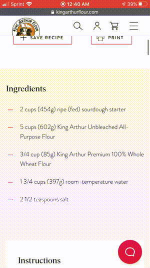

# Recipe calculator bookmarklet

This bookmarklet makes it easy to tweak the quantities in a recipe! Once installed, simply click and have all recipe ingredient quantities tied together, making it easy to adjust based on what you've got at hand.

[Recipe Calculator Link](javascript:(function(){const%20decodeVulgar%20%3D%20%7B%22%5Cu00bd%22%3A%20%221/2%22%2C%22%5Cu2153%22%3A%20%221/3%22%2C%22%5Cu2154%22%3A%20%222/3%22%2C%22%5Cu00bc%22%3A%20%221/4%22%2C%22%5Cu00be%22%3A%20%223/4%22%2C%22%5Cu2155%22%3A%20%221/5%22%2C%22%5Cu2156%22%3A%20%222/5%22%2C%22%5Cu2157%22%3A%20%223/5%22%2C%22%5Cu2158%22%3A%20%224/5%22%2C%22%5Cu2159%22%3A%20%221/6%22%2C%22%5Cu215a%22%3A%20%225/6%22%2C%22%5Cu2150%22%3A%20%221/7%22%2C%22%5Cu215b%22%3A%20%221/8%22%2C%22%5Cu215c%22%3A%20%223/8%22%2C%22%5Cu215d%22%3A%20%225/8%22%2C%22%5Cu215e%22%3A%20%227/8%22%2C%22%5Cu2151%22%3A%20%221/9%22%2C%22%5Cu2152%22%3A%20%221/10%22%2C%7D%3Bfunction%20parseNumber%28numberString%29%20%7Blet%20rx%20%3D%20/%5E%28%5Cd%2B%29%20%28%5Cd%2B%29%5C/%28%5Cd%2B%29%24/%3Blet%20match%20%3D%20rx.exec%28numberString%29%3Bif%20%28match%29%20%7Breturn%20parseFloat%28match%5B1%5D%29%20%2B%20parseFloat%28match%5B2%5D%29%20/%20parseFloat%28match%5B3%5D%29%3B%7Drx%20%3D%20/%5E%28%5Cd%2B%29%5C/%28%5Cd%2B%29%24/%3Bmatch%20%3D%20rx.exec%28numberString%29%3Bif%20%28match%29%20%7Breturn%20parseFloat%28match%5B1%5D%29%20/%20parseFloat%28match%5B2%5D%29%3B%7Drx%20%3D%20/%5E%28%5Cd%2B%29%24/%3Bmatch%20%3D%20rx.exec%28numberString%29%3Bif%20%28match%29%20%7Breturn%20parseFloat%28match%5B1%5D%29%3B%7Dthrow%20new%20Error%28%60Could%20not%20extract%20number%20%24%7BnumberString%7D%60%29%3B%7Dfunction%20parseIngredient%28ingredient%29%20%7Bfor%20%28let%20key%20of%20Object.keys%28decodeVulgar%29%29%20%7Bif%20%28ingredient.indexOf%28key%29%20%21%3D%3D%20-1%29%20%7Bconst%20replaceValue%20%3D%20%27%20%27%20%2B%20decodeVulgar%5Bkey%5D%3Bingredient%20%3D%20ingredient.replace%28new%20RegExp%28%27%20%27%2Bkey%2C%20%27g%27%29%2C%20replaceValue%29%3Bingredient%20%3D%20ingredient.replace%28new%20RegExp%28key%2C%20%27g%27%29%2C%20replaceValue%29%3B%7D%7Dconst%20rx%20%3D%20/%28%5Cd%2B%28%3F%3A%5C/%5Cd%2B%29%3F%29%28%20%5Cd%2B%5C/%5Cd%2B%29%3F/g%3Bconst%20result%20%3D%20%5B%5D%3Blet%20lastIndex%20%3D%200%3Bfunction%20addText%28match%29%20%7Bconst%20end%20%3D%20match%20%3F%20match.index%20%3A%20ingredient.length%3Bconst%20text%20%3D%20ingredient.slice%28lastIndex%2C%20end%29%3Bif%20%28text%29%20%7Bresult.push%28%7Btype%3A%20%27text%27%2Ctext%3A%20text%2C%7D%29%3B%7DlastIndex%20%3D%20end%3B%7Dwhile%20%28true%29%20%7Bconst%20match%20%3D%20rx.exec%28ingredient%29%3Bif%20%28match%20%21%3D%20null%29%20%7Blet%20open%20%3D%20ingredient.slice%280%2C%20match.index%29.match%28/%3C/g%29%20%7C%7C%20%5B%5D%3Blet%20closed%20%3D%20ingredient.slice%280%2C%20match.index%29.match%28/%3E/g%29%20%7C%7C%20%5B%5D%3Bif%20%28open.length%20%21%3D%20closed.length%29%20%7Bcontinue%3B%7D%7DaddText%28match%29%3Bif%20%28match%20%3D%3D%20null%29%20%7Bbreak%3B%7Dconst%20matchString%20%3D%20match%5B0%5D%3BlastIndex%20%3D%20match.index%20%2B%20matchString.length%3Blet%20unit%3Bfor%20%28const%20conversion%20of%20CONVERSIONS_LIST%29%20%7Bfor%20%28const%20u%20of%20conversion.units%29%20%7Bconst%20queryString%20%3D%20%27%20%27%20%2B%20u%3Bif%20%28ingredient.slice%28lastIndex%29.startsWith%28queryString%29%29%20%7Bunit%20%3D%20conversion.units%5B0%5D%3BlastIndex%20%2B%3D%20queryString.length%3B%7D%7D%7Dresult.push%28%7Btype%3A%20%27number%27%2Ctext%3A%20matchString%2Cvalue%3A%20parseNumber%28matchString%29%2Cunit%2C%7D%29%3B%7DaddText%28null%29%3Breturn%20result%3B%7Dconst%20decimalCount%20%3D%202%3Bconst%20renderSuffix%20%3D%20%7B%7D%3BrenderSuffix%5B%280%29.toFixed%28decimalCount%29.slice%281%29%5D%20%3D%20%27%27%3Bfor%20%28let%20denom%20%3D%200%3B%20denom%20%3C%2010%3B%20denom%2B%2B%29%20%7Bfor%20%28let%20numer%20%3D%200%3B%20numer%20%3C%20denom%3B%20numer%2B%2B%29%20%7Bconst%20suffix%20%3D%20%28numer/denom%29.toFixed%282%29.slice%281%29%3Bif%20%28%21renderSuffix.hasOwnProperty%28suffix%29%29%20%7BrenderSuffix%5Bsuffix%5D%20%3D%20%60%20%24%7Bnumer%7D/%24%7Bdenom%7D%60%3B%7D%7D%7Dfunction%20renderNumber%28n%29%20%7Blet%20v%20%3D%20%28n%29.toFixed%28decimalCount%29%3Bconst%20suffix%20%3D%20v.slice%28v.length%20-%20%28decimalCount%20%2B%201%29%29%3Bif%20%28renderSuffix.hasOwnProperty%28suffix%29%29%20%7Bv%20%3D%20v.slice%280%2C%20v.length-suffix.length%29%20%2B%20renderSuffix%5Bsuffix%5D%3B%7Dconst%20prefix%20%3D%20%270%20%27%3Bif%20%28v.startsWith%28prefix%29%29%20%7Bv%20%3D%20v.slice%28prefix.length%29%3B%7Dreturn%20v%3B%7Dconst%20CONVERSIONS_LIST%20%3D%20%5B%5D%3Bconst%20CONVERSIONS%20%3D%20%7B%7D%3Bconst%20RELATED_CONVERSIONS%20%3D%20%7B%7D%3Bfunction%20addConversionSet%28conversions%29%20%7Bfor%20%28const%20c%20of%20conversions%29%20%7BCONVERSIONS_LIST.push%28c%29%3Bfor%20%28const%20unit%20of%20c.units%29%20%7BRELATED_CONVERSIONS%5Bunit%5D%20%3D%20conversions%3BCONVERSIONS%5Bunit%5D%20%3D%20c%3B%7D%7D%7DaddConversionSet%28%5B%7Bunits%3A%20%5B%27teaspoon%27%2C%20%27teaspoons%27%2C%20%27tsp%27%5D%2C%20scale%3A%201/48%7D%2C%7Bunits%3A%20%5B%27tablespoon%27%2C%20%27tablespoons%27%2C%20%27tbsp%27%5D%2C%20scale%3A%201/16%7D%2C%7Bunits%3A%20%5B%27cup%27%2C%20%27cups%27%5D%2C%20scale%3A%201%7D%2C%7Bunits%3A%20%5B%27pint%27%2C%20%27pints%27%5D%2C%20scale%3A%202%7D%2C%7Bunits%3A%20%5B%27quart%27%2C%20%27quarts%27%5D%2C%20scale%3A%204%7D%2C%7Bunits%3A%20%5B%27gallon%27%2C%20%27gallons%27%5D%2C%20scale%3A%2016%7D%2C%5D%29%3Bfunction%20renderUnitSelector%28quantity%2C%20unit%2C%20ratio%29%20%7Bconst%20cs%20%3D%20RELATED_CONVERSIONS%5Bquantity.unit%5D%3Bconst%20options%20%3D%20cs.map%28%28c%29%20%3D%3E%20%7Bconst%20selected%20%3D%20c.units.indexOf%28unit%29%20%3D%3D%20-1%20%3F%20%27%27%20%3A%20%27selected%27%3Bconst%20v%20%3D%20selected%20%3F%20%27%27%20%3A%20renderNumber%28ratio%20%2A%20convertQuantity%28quantity%2C%20c.units%5B0%5D%29%29%3Breturn%20%60%3Coption%20value%3D%22%24%7Bc.units%5B0%5D%7D%22%20%24%7Bselected%7D%3E%24%7Bv%7D%20%24%7Bc.units%5B0%5D%7D%3C/option%3E%60%3B%7D%29%3Breturn%20%60%3Cselect%20class%3D%22EditableUnit%22%3E%24%7Boptions%7D%3C/select%3E%60%3B%7Dfunction%20convertQuantity%28quantity%2C%20unit%29%20%7Bif%20%28%21unit%29%20%7Breturn%20quantity.value%3B%7Dreturn%20quantity.value%20%2A%20CONVERSIONS%5Bquantity.unit%5D.scale%20/%20CONVERSIONS%5Bunit%5D.scale%3B%7Dfunction%20renderIngredient%28ingredientIdx%2C%20ingredient%2C%20ratio%2C%20units%29%20%7Breturn%20ingredient.map%28%28q%2C%20quantityIdx%29%20%3D%3E%20%7Bif%20%28q.type%20%3D%3D%20%27text%27%29%20%7Breturn%20q.text%3B%7D%20else%20if%20%28q.type%20%3D%3D%20%27number%27%29%20%7Bconst%20unit%20%3D%20units%5BquantityIdx%5D%3Bconst%20converted%20%3D%20convertQuantity%28q%2C%20unit%29%3Bconst%20v%20%3D%20renderNumber%28ratio%2Aconverted%29%3Bconst%20number%20%3D%20%27%3Cspan%20contenteditable%20class%3D%22EditableNumber%22%20data-value%3D%22%27%2Bconverted%2B%27%22%3E%27%2Bv%2B%27%3C/span%3E%27%3Blet%20editableUnit%3Bif%20%28unit%29%20%7BeditableUnit%20%3D%20renderUnitSelector%28q%2C%20unit%2C%20ratio%29%3B%7Dreturn%20%60%3Cspan%20class%3D%22EditableQuantity%22%20data-idx%3D%22%24%7BingredientIdx%7D%2C%24%7BquantityIdx%7D%22%3E%24%7Bnumber%7D%24%7BeditableUnit%20%7C%7C%20%27%27%7D%3C/span%3E%60%3B%7D%7D%29.join%28%27%27%29%3B%7Dfunction%20editNumber%28el%2C%20setRatio%2C%20undoEdit%29%20%7Bconst%20value%20%3D%20parseFloat%28el.dataset.value%29%3Blet%20newValue%3Btry%20%7BnewValue%20%3D%20parseNumber%28el.textContent%29%3B%7D%20catch%28e%29%20%7BundoEdit%28el%29%3BerrorDialog%28e.message%29%3Breturn%3B%7Dconst%20ratio%20%3D%20newValue%20/%20value%3BsetRatio%28ratio%29%3B%7Dconst%20defaultSelector%20%3D%20%28%27%5Bitemprop%3D%22recipeIngredient%22%5D%2C%27%20%2B%27%5Bitemprop%3D%22ingredients%22%5D%2C%27%20%2B%27%5Bitemprop%3D%22recipeYield%22%5D%27%29%3Bconst%20selector%20%3D%20%7B%27cooking.nytimes.com%27%3A%20%27.recipe-ingredients%20%3E%20li%20%3E%20span%2C%20.recipe-yield-value%27%2C%27www.kingarthurflour.com%27%3A%20%27.recipe%20.recipe__ingredients%20ul%20li%2C%20.stat__item--yield%27%2C%27www.bonappetit.com%27%3A%20%27.ingredients%20.ingredients__text%27%2C%7D%5Bwindow.location.hostname%5D%20%7C%7C%20defaultSelector%3Bfunction%20errorDialog%28e%29%20%7Bconst%20reportEmail%20%3D%20%27carloscorrea137%2Brecipe_calc%40gmail.com%27%3Balert%28%60Recipe%20calculator%20ran%20into%20some%20issues%20with%20%24%7Bwindow.location.href%7D%3A%5Cn%5Cn%24%7Be%7D%5Cn%5CnEmail%20%24%7BreportEmail%7D%20with%20a%20screenshot.%60%29%3B%7Dfunction%20init%28%29%20%7Bconst%20ingredients%20%3D%20Array.from%28document.querySelectorAll%28selector%29%29%3Bif%20%28%21ingredients.length%29%20%7BerrorDialog%28%22Couldn%27t%20find%20ingredients%20on%20this%20website.%22%29%3Breturn%3B%7Dconst%20errors%20%3D%20%5B%5D%3Bconst%20parsed%20%3D%20ingredients.map%28el%20%3D%3E%20%7Btry%20%7Breturn%20parseIngredient%28el.innerHTML%29%3B%7D%20catch%28e%29%20%7Berrors.push%28e%29%3B%7D%7D%29%3Bif%20%28errors.length%29%20%7BerrorDialog%28errors.map%28e%20%3D%3E%20e.message%29.join%28%27%5Cn%27%29%29%3Breturn%3B%7Dconst%20state%20%3D%20%7Bratio%3A%201.%2Cunits%3A%20parsed.map%28i%20%3D%3E%20i.map%28q%20%3D%3E%20q.unit%29%29%2C%7D%3Bfunction%20setState%28nextState%29%20%7Bif%20%28nextState.hasOwnProperty%28%27ratio%27%29%29%20%7Bstate.ratio%20%3D%20nextState.ratio%3B%7D%20else%20if%20%28nextState.hasOwnProperty%28%27units%27%29%29%20%7Bfor%20%28const%20ingredientIdx%20of%20Object.keys%28nextState.units%29%29%20%7Bfor%20%28const%20quantityIdx%20of%20Object.keys%28nextState.units%5BingredientIdx%5D%29%29%20%7Bstate.units%5BingredientIdx%5D%5BquantityIdx%5D%20%3D%20nextState.units%5BingredientIdx%5D%5BquantityIdx%5D%3B%7D%7D%7Dingredients.forEach%28%28el%2C%20idx%29%20%3D%3E%20%7Bel.innerHTML%20%3D%20renderIngredient%28idx%2C%20parsed%5Bidx%5D%2C%20state.ratio%2C%20state.units%5Bidx%5D%29%3B%7D%29%3B%7Dfunction%20setRatio%28ratio%29%20%7BsetState%28%7Bratio%7D%29%3B%7DsetState%28%7B%7D%29%3Blet%20mostRecentFocus%3Bdocument.addEventListener%28%27focusin%27%2C%20function%28e%29%20%7Bif%20%28e.target.classList.contains%28%27EditableNumber%27%29%29%20%7Bconst%20p%20%3D%20e.target%3Bvar%20s%20%3D%20window.getSelection%28%29%3Bvar%20r%20%3D%20document.createRange%28%29%3Br.setStart%28p%2C%200%29%3Br.setEnd%28p%2C%201%29%3Bs.removeAllRanges%28%29%3Bs.addRange%28r%29%3BmostRecentFocus%20%3D%20e.target.textContent%3B%7D%7D%29%3Bfunction%20undoEdit%28el%29%20%7Bif%20%28mostRecentFocus%29%20%7Bel.textContent%20%3D%20mostRecentFocus%3B%7D%7Ddocument.addEventListener%28%27focusout%27%2C%20function%28e%29%20%7Bif%20%28e.target.classList.contains%28%27EditableNumber%27%29%29%20%7Bif%20%28e.target.textContent%20%21%3D%20mostRecentFocus%29%20%7BeditNumber%28e.target%2C%20setRatio%2C%20undoEdit%29%3B%7DmostRecentFocus%20%3D%20null%3B%7D%7D%29%3Bdocument.addEventListener%28%27keydown%27%2C%20function%28e%29%20%7Bif%20%28e.target.classList.contains%28%27EditableNumber%27%29%29%20%7Bif%20%28e.keyCode%20%3D%3D%2013%29%20%7Be.preventDefault%28%29%3BeditNumber%28e.target%2C%20setRatio%2C%20undoEdit%29%3B%7D%7D%7D%29%3Bdocument.addEventListener%28%27change%27%2C%20function%28e%29%20%7Bif%20%28e.target.classList.contains%28%27EditableUnit%27%29%29%20%7Bconst%20el%20%3D%20e.target%3Bconst%20editableQuantity%20%3D%20el.parentElement%3Bconst%20unit%20%3D%20el.options%5Bel.selectedIndex%5D.value%3Bconst%20%5BingredientIdx%2C%20quantityIdx%5D%20%3D%20editableQuantity.dataset.idx.split%28%27%2C%27%29.map%28i%20%3D%3E%20parseInt%28i%2C%2010%29%29%3BsetState%28%7Bunits%3A%20%7B%5BingredientIdx%5D%3A%20%7B%5BquantityIdx%5D%3A%20unit%2C%7D%2C%7D%7D%29%3B%7D%7D%29%3B%7Dfunction%20addStyle%28styleString%29%20%7Bconst%20style%20%3D%20document.createElement%28%27style%27%29%3Bstyle.textContent%20%3D%20styleString%3Bdocument.head.append%28style%29%3B%7DaddStyle%28%60.EditableNumber%20%7Bborder%3A%201px%20solid%20black%3Bborder-radius%3A%202px%3Bpadding%3A%200%202px%3Bline-height%3A%201.4rem%3B%7D%60%29%3Binit%28%29%3B})();)



## Installation

On a desktop computer, drag the bookmarklet link above to your bookmarks toolbar.

On iOS,
1. Bookmark this page (tap share icon, then bookmark icon).
2. Copy this text: `javascript:(function(){const%20decodeVulgar%20%3D%20%7B%22%5Cu00bd%22%3A%20%221/2%22%2C%22%5Cu2153%22%3A%20%221/3%22%2C%22%5Cu2154%22%3A%20%222/3%22%2C%22%5Cu00bc%22%3A%20%221/4%22%2C%22%5Cu00be%22%3A%20%223/4%22%2C%22%5Cu2155%22%3A%20%221/5%22%2C%22%5Cu2156%22%3A%20%222/5%22%2C%22%5Cu2157%22%3A%20%223/5%22%2C%22%5Cu2158%22%3A%20%224/5%22%2C%22%5Cu2159%22%3A%20%221/6%22%2C%22%5Cu215a%22%3A%20%225/6%22%2C%22%5Cu2150%22%3A%20%221/7%22%2C%22%5Cu215b%22%3A%20%221/8%22%2C%22%5Cu215c%22%3A%20%223/8%22%2C%22%5Cu215d%22%3A%20%225/8%22%2C%22%5Cu215e%22%3A%20%227/8%22%2C%22%5Cu2151%22%3A%20%221/9%22%2C%22%5Cu2152%22%3A%20%221/10%22%2C%7D%3Bfunction%20parseNumber%28numberString%29%20%7Blet%20rx%20%3D%20/%5E%28%5Cd%2B%29%20%28%5Cd%2B%29%5C/%28%5Cd%2B%29%24/%3Blet%20match%20%3D%20rx.exec%28numberString%29%3Bif%20%28match%29%20%7Breturn%20parseFloat%28match%5B1%5D%29%20%2B%20parseFloat%28match%5B2%5D%29%20/%20parseFloat%28match%5B3%5D%29%3B%7Drx%20%3D%20/%5E%28%5Cd%2B%29%5C/%28%5Cd%2B%29%24/%3Bmatch%20%3D%20rx.exec%28numberString%29%3Bif%20%28match%29%20%7Breturn%20parseFloat%28match%5B1%5D%29%20/%20parseFloat%28match%5B2%5D%29%3B%7Drx%20%3D%20/%5E%28%5Cd%2B%29%24/%3Bmatch%20%3D%20rx.exec%28numberString%29%3Bif%20%28match%29%20%7Breturn%20parseFloat%28match%5B1%5D%29%3B%7Dthrow%20new%20Error%28%60Could%20not%20extract%20number%20%24%7BnumberString%7D%60%29%3B%7Dfunction%20parseIngredient%28ingredient%29%20%7Bfor%20%28let%20key%20of%20Object.keys%28decodeVulgar%29%29%20%7Bif%20%28ingredient.indexOf%28key%29%20%21%3D%3D%20-1%29%20%7Bconst%20replaceValue%20%3D%20%27%20%27%20%2B%20decodeVulgar%5Bkey%5D%3Bingredient%20%3D%20ingredient.replace%28new%20RegExp%28%27%20%27%2Bkey%2C%20%27g%27%29%2C%20replaceValue%29%3Bingredient%20%3D%20ingredient.replace%28new%20RegExp%28key%2C%20%27g%27%29%2C%20replaceValue%29%3B%7D%7Dconst%20rx%20%3D%20/%28%5Cd%2B%28%3F%3A%5C/%5Cd%2B%29%3F%29%28%20%5Cd%2B%5C/%5Cd%2B%29%3F/g%3Bconst%20result%20%3D%20%5B%5D%3Blet%20lastIndex%20%3D%200%3Bfunction%20addText%28match%29%20%7Bconst%20end%20%3D%20match%20%3F%20match.index%20%3A%20ingredient.length%3Bconst%20text%20%3D%20ingredient.slice%28lastIndex%2C%20end%29%3Bif%20%28text%29%20%7Bresult.push%28%7Btype%3A%20%27text%27%2Ctext%3A%20text%2C%7D%29%3B%7DlastIndex%20%3D%20end%3B%7Dwhile%20%28true%29%20%7Bconst%20match%20%3D%20rx.exec%28ingredient%29%3Bif%20%28match%20%21%3D%20null%29%20%7Blet%20open%20%3D%20ingredient.slice%280%2C%20match.index%29.match%28/%3C/g%29%20%7C%7C%20%5B%5D%3Blet%20closed%20%3D%20ingredient.slice%280%2C%20match.index%29.match%28/%3E/g%29%20%7C%7C%20%5B%5D%3Bif%20%28open.length%20%21%3D%20closed.length%29%20%7Bcontinue%3B%7D%7DaddText%28match%29%3Bif%20%28match%20%3D%3D%20null%29%20%7Bbreak%3B%7Dconst%20matchString%20%3D%20match%5B0%5D%3BlastIndex%20%3D%20match.index%20%2B%20matchString.length%3Blet%20unit%3Bfor%20%28const%20conversion%20of%20CONVERSIONS_LIST%29%20%7Bfor%20%28const%20u%20of%20conversion.units%29%20%7Bconst%20queryString%20%3D%20%27%20%27%20%2B%20u%3Bif%20%28ingredient.slice%28lastIndex%29.startsWith%28queryString%29%29%20%7Bunit%20%3D%20conversion.units%5B0%5D%3BlastIndex%20%2B%3D%20queryString.length%3B%7D%7D%7Dresult.push%28%7Btype%3A%20%27number%27%2Ctext%3A%20matchString%2Cvalue%3A%20parseNumber%28matchString%29%2Cunit%2C%7D%29%3B%7DaddText%28null%29%3Breturn%20result%3B%7Dconst%20decimalCount%20%3D%202%3Bconst%20renderSuffix%20%3D%20%7B%7D%3BrenderSuffix%5B%280%29.toFixed%28decimalCount%29.slice%281%29%5D%20%3D%20%27%27%3Bfor%20%28let%20denom%20%3D%200%3B%20denom%20%3C%2010%3B%20denom%2B%2B%29%20%7Bfor%20%28let%20numer%20%3D%200%3B%20numer%20%3C%20denom%3B%20numer%2B%2B%29%20%7Bconst%20suffix%20%3D%20%28numer/denom%29.toFixed%282%29.slice%281%29%3Bif%20%28%21renderSuffix.hasOwnProperty%28suffix%29%29%20%7BrenderSuffix%5Bsuffix%5D%20%3D%20%60%20%24%7Bnumer%7D/%24%7Bdenom%7D%60%3B%7D%7D%7Dfunction%20renderNumber%28n%29%20%7Blet%20v%20%3D%20%28n%29.toFixed%28decimalCount%29%3Bconst%20suffix%20%3D%20v.slice%28v.length%20-%20%28decimalCount%20%2B%201%29%29%3Bif%20%28renderSuffix.hasOwnProperty%28suffix%29%29%20%7Bv%20%3D%20v.slice%280%2C%20v.length-suffix.length%29%20%2B%20renderSuffix%5Bsuffix%5D%3B%7Dconst%20prefix%20%3D%20%270%20%27%3Bif%20%28v.startsWith%28prefix%29%29%20%7Bv%20%3D%20v.slice%28prefix.length%29%3B%7Dreturn%20v%3B%7Dconst%20CONVERSIONS_LIST%20%3D%20%5B%5D%3Bconst%20CONVERSIONS%20%3D%20%7B%7D%3Bconst%20RELATED_CONVERSIONS%20%3D%20%7B%7D%3Bfunction%20addConversionSet%28conversions%29%20%7Bfor%20%28const%20c%20of%20conversions%29%20%7BCONVERSIONS_LIST.push%28c%29%3Bfor%20%28const%20unit%20of%20c.units%29%20%7BRELATED_CONVERSIONS%5Bunit%5D%20%3D%20conversions%3BCONVERSIONS%5Bunit%5D%20%3D%20c%3B%7D%7D%7DaddConversionSet%28%5B%7Bunits%3A%20%5B%27teaspoon%27%2C%20%27teaspoons%27%2C%20%27tsp%27%5D%2C%20scale%3A%201/48%7D%2C%7Bunits%3A%20%5B%27tablespoon%27%2C%20%27tablespoons%27%2C%20%27tbsp%27%5D%2C%20scale%3A%201/16%7D%2C%7Bunits%3A%20%5B%27cup%27%2C%20%27cups%27%5D%2C%20scale%3A%201%7D%2C%7Bunits%3A%20%5B%27pint%27%2C%20%27pints%27%5D%2C%20scale%3A%202%7D%2C%7Bunits%3A%20%5B%27quart%27%2C%20%27quarts%27%5D%2C%20scale%3A%204%7D%2C%7Bunits%3A%20%5B%27gallon%27%2C%20%27gallons%27%5D%2C%20scale%3A%2016%7D%2C%5D%29%3Bfunction%20renderUnitSelector%28quantity%2C%20unit%2C%20ratio%29%20%7Bconst%20cs%20%3D%20RELATED_CONVERSIONS%5Bquantity.unit%5D%3Bconst%20options%20%3D%20cs.map%28%28c%29%20%3D%3E%20%7Bconst%20selected%20%3D%20c.units.indexOf%28unit%29%20%3D%3D%20-1%20%3F%20%27%27%20%3A%20%27selected%27%3Bconst%20v%20%3D%20selected%20%3F%20%27%27%20%3A%20renderNumber%28ratio%20%2A%20convertQuantity%28quantity%2C%20c.units%5B0%5D%29%29%3Breturn%20%60%3Coption%20value%3D%22%24%7Bc.units%5B0%5D%7D%22%20%24%7Bselected%7D%3E%24%7Bv%7D%20%24%7Bc.units%5B0%5D%7D%3C/option%3E%60%3B%7D%29%3Breturn%20%60%3Cselect%20class%3D%22EditableUnit%22%3E%24%7Boptions%7D%3C/select%3E%60%3B%7Dfunction%20convertQuantity%28quantity%2C%20unit%29%20%7Bif%20%28%21unit%29%20%7Breturn%20quantity.value%3B%7Dreturn%20quantity.value%20%2A%20CONVERSIONS%5Bquantity.unit%5D.scale%20/%20CONVERSIONS%5Bunit%5D.scale%3B%7Dfunction%20renderIngredient%28ingredientIdx%2C%20ingredient%2C%20ratio%2C%20units%29%20%7Breturn%20ingredient.map%28%28q%2C%20quantityIdx%29%20%3D%3E%20%7Bif%20%28q.type%20%3D%3D%20%27text%27%29%20%7Breturn%20q.text%3B%7D%20else%20if%20%28q.type%20%3D%3D%20%27number%27%29%20%7Bconst%20unit%20%3D%20units%5BquantityIdx%5D%3Bconst%20converted%20%3D%20convertQuantity%28q%2C%20unit%29%3Bconst%20v%20%3D%20renderNumber%28ratio%2Aconverted%29%3Bconst%20number%20%3D%20%27%3Cspan%20contenteditable%20class%3D%22EditableNumber%22%20data-value%3D%22%27%2Bconverted%2B%27%22%3E%27%2Bv%2B%27%3C/span%3E%27%3Blet%20editableUnit%3Bif%20%28unit%29%20%7BeditableUnit%20%3D%20renderUnitSelector%28q%2C%20unit%2C%20ratio%29%3B%7Dreturn%20%60%3Cspan%20class%3D%22EditableQuantity%22%20data-idx%3D%22%24%7BingredientIdx%7D%2C%24%7BquantityIdx%7D%22%3E%24%7Bnumber%7D%24%7BeditableUnit%20%7C%7C%20%27%27%7D%3C/span%3E%60%3B%7D%7D%29.join%28%27%27%29%3B%7Dfunction%20editNumber%28el%2C%20setRatio%2C%20undoEdit%29%20%7Bconst%20value%20%3D%20parseFloat%28el.dataset.value%29%3Blet%20newValue%3Btry%20%7BnewValue%20%3D%20parseNumber%28el.textContent%29%3B%7D%20catch%28e%29%20%7BundoEdit%28el%29%3BerrorDialog%28e.message%29%3Breturn%3B%7Dconst%20ratio%20%3D%20newValue%20/%20value%3BsetRatio%28ratio%29%3B%7Dconst%20defaultSelector%20%3D%20%28%27%5Bitemprop%3D%22recipeIngredient%22%5D%2C%27%20%2B%27%5Bitemprop%3D%22ingredients%22%5D%2C%27%20%2B%27%5Bitemprop%3D%22recipeYield%22%5D%27%29%3Bconst%20selector%20%3D%20%7B%27cooking.nytimes.com%27%3A%20%27.recipe-ingredients%20%3E%20li%20%3E%20span%2C%20.recipe-yield-value%27%2C%27www.kingarthurflour.com%27%3A%20%27.recipe%20.recipe__ingredients%20ul%20li%2C%20.stat__item--yield%27%2C%27www.bonappetit.com%27%3A%20%27.ingredients%20.ingredients__text%27%2C%7D%5Bwindow.location.hostname%5D%20%7C%7C%20defaultSelector%3Bfunction%20errorDialog%28e%29%20%7Bconst%20reportEmail%20%3D%20%27carloscorrea137%2Brecipe_calc%40gmail.com%27%3Balert%28%60Recipe%20calculator%20ran%20into%20some%20issues%20with%20%24%7Bwindow.location.href%7D%3A%5Cn%5Cn%24%7Be%7D%5Cn%5CnEmail%20%24%7BreportEmail%7D%20with%20a%20screenshot.%60%29%3B%7Dfunction%20init%28%29%20%7Bconst%20ingredients%20%3D%20Array.from%28document.querySelectorAll%28selector%29%29%3Bif%20%28%21ingredients.length%29%20%7BerrorDialog%28%22Couldn%27t%20find%20ingredients%20on%20this%20website.%22%29%3Breturn%3B%7Dconst%20errors%20%3D%20%5B%5D%3Bconst%20parsed%20%3D%20ingredients.map%28el%20%3D%3E%20%7Btry%20%7Breturn%20parseIngredient%28el.innerHTML%29%3B%7D%20catch%28e%29%20%7Berrors.push%28e%29%3B%7D%7D%29%3Bif%20%28errors.length%29%20%7BerrorDialog%28errors.map%28e%20%3D%3E%20e.message%29.join%28%27%5Cn%27%29%29%3Breturn%3B%7Dconst%20state%20%3D%20%7Bratio%3A%201.%2Cunits%3A%20parsed.map%28i%20%3D%3E%20i.map%28q%20%3D%3E%20q.unit%29%29%2C%7D%3Bfunction%20setState%28nextState%29%20%7Bif%20%28nextState.hasOwnProperty%28%27ratio%27%29%29%20%7Bstate.ratio%20%3D%20nextState.ratio%3B%7D%20else%20if%20%28nextState.hasOwnProperty%28%27units%27%29%29%20%7Bfor%20%28const%20ingredientIdx%20of%20Object.keys%28nextState.units%29%29%20%7Bfor%20%28const%20quantityIdx%20of%20Object.keys%28nextState.units%5BingredientIdx%5D%29%29%20%7Bstate.units%5BingredientIdx%5D%5BquantityIdx%5D%20%3D%20nextState.units%5BingredientIdx%5D%5BquantityIdx%5D%3B%7D%7D%7Dingredients.forEach%28%28el%2C%20idx%29%20%3D%3E%20%7Bel.innerHTML%20%3D%20renderIngredient%28idx%2C%20parsed%5Bidx%5D%2C%20state.ratio%2C%20state.units%5Bidx%5D%29%3B%7D%29%3B%7Dfunction%20setRatio%28ratio%29%20%7BsetState%28%7Bratio%7D%29%3B%7DsetState%28%7B%7D%29%3Blet%20mostRecentFocus%3Bdocument.addEventListener%28%27focusin%27%2C%20function%28e%29%20%7Bif%20%28e.target.classList.contains%28%27EditableNumber%27%29%29%20%7Bconst%20p%20%3D%20e.target%3Bvar%20s%20%3D%20window.getSelection%28%29%3Bvar%20r%20%3D%20document.createRange%28%29%3Br.setStart%28p%2C%200%29%3Br.setEnd%28p%2C%201%29%3Bs.removeAllRanges%28%29%3Bs.addRange%28r%29%3BmostRecentFocus%20%3D%20e.target.textContent%3B%7D%7D%29%3Bfunction%20undoEdit%28el%29%20%7Bif%20%28mostRecentFocus%29%20%7Bel.textContent%20%3D%20mostRecentFocus%3B%7D%7Ddocument.addEventListener%28%27focusout%27%2C%20function%28e%29%20%7Bif%20%28e.target.classList.contains%28%27EditableNumber%27%29%29%20%7Bif%20%28e.target.textContent%20%21%3D%20mostRecentFocus%29%20%7BeditNumber%28e.target%2C%20setRatio%2C%20undoEdit%29%3B%7DmostRecentFocus%20%3D%20null%3B%7D%7D%29%3Bdocument.addEventListener%28%27keydown%27%2C%20function%28e%29%20%7Bif%20%28e.target.classList.contains%28%27EditableNumber%27%29%29%20%7Bif%20%28e.keyCode%20%3D%3D%2013%29%20%7Be.preventDefault%28%29%3BeditNumber%28e.target%2C%20setRatio%2C%20undoEdit%29%3B%7D%7D%7D%29%3Bdocument.addEventListener%28%27change%27%2C%20function%28e%29%20%7Bif%20%28e.target.classList.contains%28%27EditableUnit%27%29%29%20%7Bconst%20el%20%3D%20e.target%3Bconst%20editableQuantity%20%3D%20el.parentElement%3Bconst%20unit%20%3D%20el.options%5Bel.selectedIndex%5D.value%3Bconst%20%5BingredientIdx%2C%20quantityIdx%5D%20%3D%20editableQuantity.dataset.idx.split%28%27%2C%27%29.map%28i%20%3D%3E%20parseInt%28i%2C%2010%29%29%3BsetState%28%7Bunits%3A%20%7B%5BingredientIdx%5D%3A%20%7B%5BquantityIdx%5D%3A%20unit%2C%7D%2C%7D%7D%29%3B%7D%7D%29%3B%7Dfunction%20addStyle%28styleString%29%20%7Bconst%20style%20%3D%20document.createElement%28%27style%27%29%3Bstyle.textContent%20%3D%20styleString%3Bdocument.head.append%28style%29%3B%7DaddStyle%28%60.EditableNumber%20%7Bborder%3A%201px%20solid%20black%3Bborder-radius%3A%202px%3Bpadding%3A%200%202px%3Bline-height%3A%201.4rem%3B%7D%60%29%3Binit%28%29%3B})();`
3. Go to bookmarks and tap "edit". Change the address to the bookmark you make in step 1 to the code.

## Supported sites:

- [New York Times Cooking](https://cooking.nytimes.com/)
- [King Arthur Flour](https://www.kingarthurflour.com/recipes)
- [bon appétit](https://www.bonappetit.com/)
- All websites with [schema.org](https://schema.org/)-compliant usage of `recipeIngredient`. Includes [Smitten Kitchen](https://smittenkitchen.com/), allrecipes, and [epicurious](https://www.epicurious.com/).

## Developer

Build new version of README with
```
make build
```

Start development server with, visit [here](http://localhost:8002/test.html)
```
make dev
```

