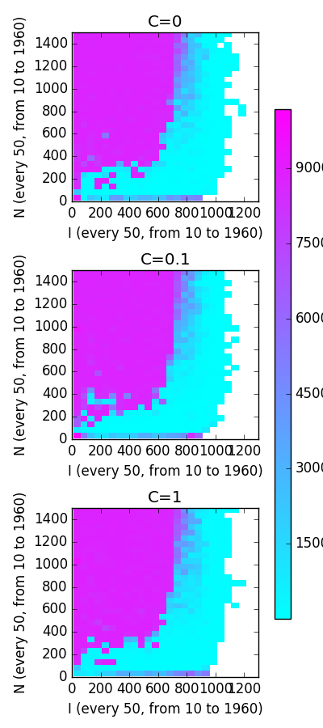

This repo contains my solution to a neural network coding exercise. To run and visualize my tensorflow implementation, run
```shell
$ python tf_impl.py
$ python 2d_result_plot.py
```

### results



there may be issues with my analysis because I take relatively large steps of 50 between values of N and I and search the space to 2000. it may be worth running this analysis with smaller steps and in smaller bounds.

interestingly, regardless of value of C, we see very similar structure in cost-space. The most erratic and regularization-dependent might be small N and small I, although randomness may be enough to explain the variance we see there.

This plot suggests to me that network architecture largely determines whether low-error approximations to a function can exist (low-error approximations can only exist when the network architecture is complex enough to approximate the function) and regularization only helps us make trade-offs between low-error approximations as it doesn't seem to affect their presence/density.

I'm somewhat surprised by the sigmoidal-ish/logarithmic-ish relationship between N and I that we see along the border between high- and low-cost architectures. I'd be interested to see what this looks like when approximating different functions. Why is there such a sharp threshold for N at ~300 that dramatically increases the number of I nodes needed for a low-cost solution? Beyond N=300, the seemingly logarithmic increase in I as N grows suggests that the number of subsets of I must scale with N.

I'd guess that regularized networks generalize better and retain this structure on validation sets (networks with lower C values would have higher error across the board, or we'd see this border between high- and low-cost architectures creep towards low-cost architectures).

note: white regions to the right are NaNs resulting from learning rate too high to let gradient descent converge (plots show their error only increasing. smaller learning rate results in convergence in a handful of test). Will consider tuning gradient descent to make those points better.


### issues
The current parameters in my tensorflow solution will take a few hours with GPU and a day or so without to compute. There's a handy progress bar with completion estimation to make the wait a bit easier to expect.

Issues in current implementation:
- currently excluding the `h_8(x) = tan(π ∗ (x + 0.5))` which has very large values that cause issues for cost computation.
- should validate learned networks against validation set like `np.arange(0.05, 10, .1)`
- tensorflow: gradient descent learning rate works in lots of cases, but should be tuned to prevent NaNs for large (>1000) I layers
- tensorflow: should detect or add gradient descent convergence detection instead of having a static number of iterations.
- numpy/autodiff/theano implementation has a ton of warts and can't really work for large numbers of tests.
    - not sure how to get it to run on GPU
    - converting to float32 from float64 seems to result in lots of rounding errors/issues
    - seems to be much slower in general, I wonder if making convergence threshold lower would help?


### install
To install requirements used by my scripts, try
```shell
$ pip install -r requirements.txt
# on linux with gpu
$ pip install https://storage.googleapis.com/tensorflow/linux/gpu/tensorflow-0.11.0-cp27-none-linux_x86_64.whl
# on mac with cpu
$ pip install https://storage.googleapis.com/tensorflow/mac/cpu/tensorflow-0.11.0-py2-none-any.whl
```
Alternatively, you can use this ansible script to spin up a GPU instance in ec2. I used this to do my final analysis. https://github.com/cgc/ansible-examples
