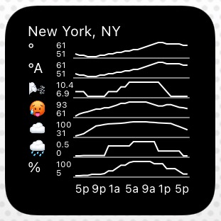

This is the code for an iOS widget showing weather information for your current location. It can be installed through the use of [Scriptable](https://scriptable.app/), a platform for iOS automation via JavaScript. It uses an API from the [National Weather Service of the United States](https://www.weather.gov/), so it only works in the US.

## Install
Copy `weather-widget.js` to the directory for your Scriptable. If you're syncing between your phone and Mac, you can copy it into `~/Library/Mobile Documents/iCloud~dk~simonbs~Scriptable`. You can now add a Scriptable widget to your home screen. To see the weather, configure the widget to exectute `weather-widget.js`.
